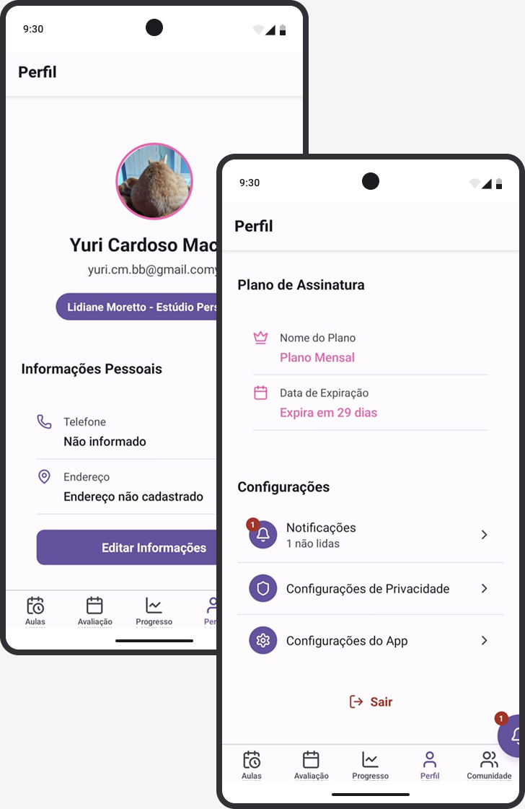
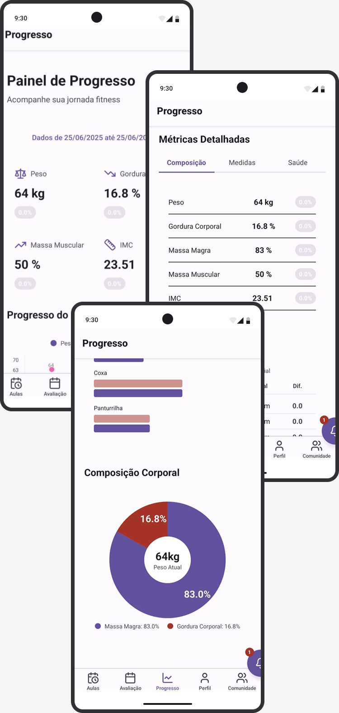

# TreinOPP

## 1. Visão Geral

O TreinOPP é um aplicativo mobile desenvolvido para auxiliar academias, treinadores e alunos na gestão de treinos, acompanhamento de progresso e integração da comunidade fitness. Este projeto foi idealizado especialmente para atender às necessidades da Lidiane, levando em consideração suas demandas específicas no contexto de acompanhamento de alunos e organização de atividades.

**Objetivo principal:**
Facilitar o acompanhamento e a personalização de treinos, promovendo o engajamento dos alunos e otimizando o trabalho dos profissionais de educação física.

**Público-alvo:**

- Alunos de academias que desejam acompanhar seu progresso e receber orientações personalizadas
- Treinadores e profissionais de educação física
- Gestores de academias interessados em modernizar a experiência dos seus clientes

## 2. Funcionalidades Principais

**Principais funcionalidades:**

- Cadastro e autenticação de usuários (alunos e treinadores)
- Marcação e visualização de aulas e horários
- Acompanhamento do progresso dos alunos
- Notificações em tempo real para lembretes e avisos
- Área de comunidade para interação entre alunos e treinadores
- Perfil personalizado para cada usuário
- Configurações de privacidade e notificações

**Diferenciais em relação a soluções similares:**

- Projeto personalizado para atender às necessidades específicas da Lidiane
- Foco na simplicidade e facilidade de uso para todos os perfis de usuário
- Integração eficiente entre acompanhamento de progresso e comunicação
- Possibilidade de customização futura conforme feedback dos usuários

## 3. Tecnologias Utilizadas

**Frameworks e bibliotecas principais:**

- Expo: Plataforma para desenvolvimento de aplicativos React Native
- React Native: Framework para desenvolvimento mobile multiplataforma
- Appwrite: Backend como serviço para autenticação, banco de dados e notificações

**Outras dependências relevantes:**

- TypeScript: Tipagem estática para JavaScript
- React Navigation: Navegação entre telas no app
- Axios: Requisições HTTP
- Context API: Gerenciamento de estado global
- ESLint e Prettier: Padronização e qualidade de código
- Outras bibliotecas específicas para UI, animações e notificações

## 4. Instalação e Configuração

### Pré-requisitos

- Node.js e npm ou Yarn instalados
- Expo CLI instalado globalmente (`npm install -g expo-cli`)
- Conta e instância do Appwrite configuradas (backend)
- Acesso à plataforma web do Appwrite para gerenciamento dos dados e usuários

### Passos para instalação das dependências

1. Clone o repositório do projeto a partir do seu GitHub
2. Instale as dependências do projeto:
   ```bash
   yarn
   # ou
   npm install
   ```
3. Instale e configure o Appwrite conforme a [documentação oficial](https://appwrite.io/docs)

### Configuração de variáveis de ambiente e serviços externos

- Configure as variáveis de ambiente necessárias para conectar o app ao seu backend Appwrite (exemplo: endpoint, projectId, etc.)
- As configurações do Appwrite podem ser gerenciadas e exportadas/importadas usando a plataforma web ou via CLI
- Para aplicar as configurações do Appwrite presentes em `/src`, utilize:
  ```bash
  npx appwrite push
  ```
  > Obs: É necessário estar logado previamente na CLI do Appwrite (`npx appwrite login`)

## 6. Como Executar o Projeto

### Rodando em modo desenvolvimento

Execute o comando abaixo para iniciar o app em modo desenvolvimento:

```bash
yarn start
# ou
npm run start
```

Isso abrirá o Expo DevTools, permitindo rodar o app em emuladores Android/iOS ou no dispositivo físico via QR Code.

### Rodando em produção

Para gerar um build de produção, utilize:

```bash
yarn build
# ou
npm run build
```

Consulte a documentação do Expo para detalhes sobre publicação e builds para lojas.

## 7. Screenshots do APP





## 14. Créditos e Referências

Este projeto foi desenvolvido de forma colaborativa pelo grupo, com participação ativa de todos os integrantes nas etapas de concepção, desenvolvimento e testes.

**Equipe de desenvolvimento:**

- Rhyan Kaique
- João Augusto
- Yuri Cardoso
- Lucas

**Fontes e materiais de apoio:**

- Documentação oficial do Expo
- Documentação oficial do Appwrite
- Outros materiais e referências utilizados durante o desenvolvimento
